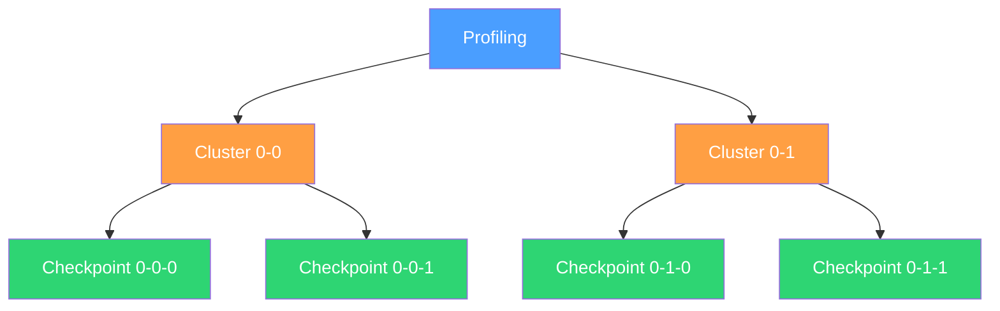
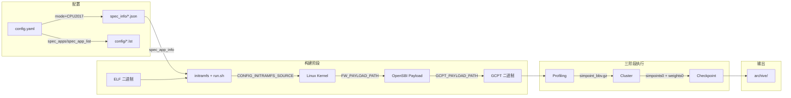
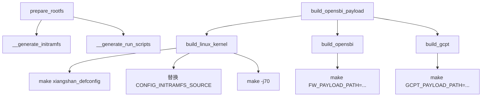
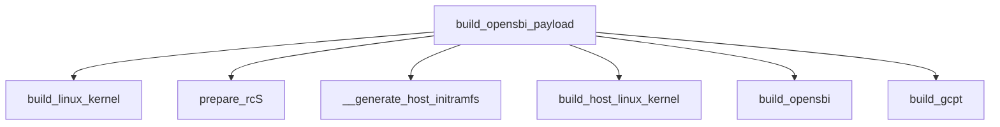
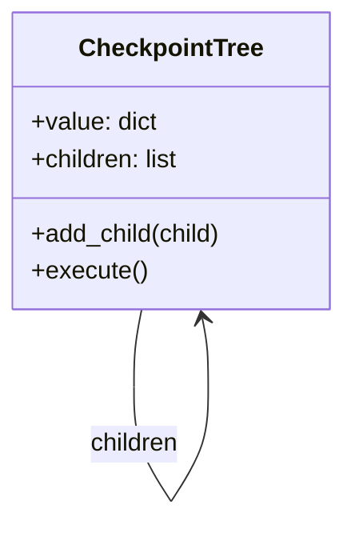

# 架构概述

## 三阶段流程

本项目通过 Profiling → Cluster → Checkpoint 三阶段生成 SimPoint Checkpoint，流程用树形结构（CheckpointTree）组织：



**Profiling**：NEMU/QEMU 运行 workload，按固定 interval 采集 BBV（Basic Block Vector），输出 `simpoint_bbv.gz`。

**Cluster**：SimPoint 工具对 BBV 做 k-means 聚类，输出代表点（`simpoints0`）及权重（`weights0`）。

**Checkpoint**：NEMU/QEMU 在 SimPoint 代表点处生成 checkpoint 文件（zstd 压缩格式）。

执行时按层并行（`level_first_exec`）：同层所有节点并行执行，下一层等上一层全部完成后才开始。

## 数据流



## 目录结构

```
checkpoint_scripts/
├── config.yaml              # 主配置文件
├── generate_checkpoint.py   # 入口脚本
├── generate_bbl.py          # RootfsBuilder：构建 workload
├── take_checkpoint.py       # CheckpointTree：三阶段命令树
├── dump_result.py           # 导出 checkpoint list 和权重
├── select_points.py         # 筛选 checkpoint 点
├── config.py                # BaseConfig 基类
├── spec_info/               # SPEC 子项元数据
│   ├── spec06.json          # SPEC2006
│   ├── spec17.json          # SPEC2017 rate 模式
│   ├── spec17_speed.json    # SPEC2017 speed 模式
│   ├── spec17_rate_int.json # SPEC2017 rate 整数子集
│   ├── spec17_rate_fp.json  # SPEC2017 rate 浮点子集
│   ├── spec17_speed_int.json
│   └── spec17_speed_fp.json
├── config/                  # 预定义配置模板
│   ├── *.yaml               # 不同编译器/测试集的配置
│   └── *.lst                # SPEC 子项列表文件
└── archive/                 # 生成的 checkpoint 结果
    └── <archive_id>/
        ├── elf/             # 复制的 ELF 文件
        ├── assembly/        # 反汇编文件
        ├── bin/             # 构建产物
        ├── gcpt_bins/       # GCPT 二进制（三阶段输入）
        ├── scripts/         # 生成的 initramfs/run 脚本
        ├── build/           # 构建中间产物
        │   ├── linux/
        │   ├── opensbi/
        │   └── gcpt/
        ├── logs/            # 运行日志
        │   ├── build/
        │   ├── prepare/
        │   ├── profiling-*/
        │   ├── cluster-*-*/
        │   └── checkpoint-*-*/
        ├── profiling-*/     # BBV 输出
        ├── cluster-*/       # SimPoint 输出
        └── checkpoint-*/    # Checkpoint 输出
```

## 核心模块

### generate_checkpoint.py — 入口

`GlobalConfigCtx` 解析 config.yaml，根据 `CPU2017` + `mode` 选择 spec_info 文件，构建 app_list，然后对每个 app 依次执行：

1. `RootfsBuilder.prepare_rootfs()` — 生成 initramfs 和 run 脚本
2. `RootfsBuilder.build_opensbi_payload()` — 编译 kernel → opensbi → gcpt
3. `generate_command()` — 构建三阶段命令树
4. `level_first_exec()` — 按层并行执行

### generate_bbl.py — RootfsBuilder

负责 workload 构建，核心方法调用链：



当 `enable_h_ext=true` 时，还会额外构建 host Linux：



### take_checkpoint.py — CheckpointTree

树形结构组织三阶段命令：



每个节点包含 `command`（执行的命令）、`out-log`/`err-log`（日志路径）、`execute_mode`（profiling/cluster/checkpoint）。

`generate_command()` 根据 `TakeCheckpointConfig` 中的 `times` 和 `start_id` 展开 `itertools.product`，为每种 (profiling_id, cluster_id, checkpoint_id) 组合创建树节点。

### dump_result.py — 结果导出

从 profiling log 提取指令数，从 cluster 结果提取权重，生成 JSON 和 checkpoint list。支持 `--mode speed|rate` 和 `--suite int|fp|all` 参数选择 benchmark 列表。

### select_points.py — 点筛选

按权重覆盖率（`-w`）或数量上限（`-c`）筛选 checkpoint 点，从 cluster JSON 中挑选最重要的代表点。
