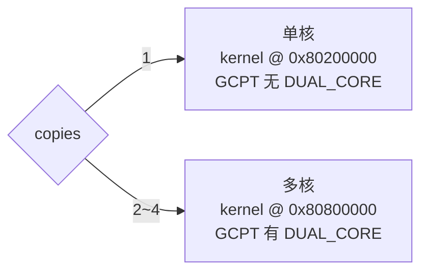
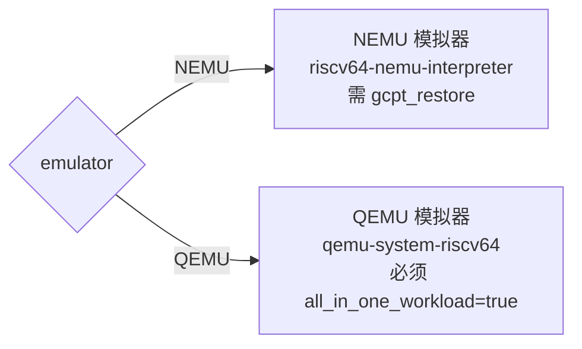

# 配置文件参考

## config.yaml 结构

```yaml
base_config:
  # === 测试模式 ===
  mode: "speed"                   # 可选 "speed" 或 "rate"，默认 "speed"
  CPU2017: true                   # 目标是否为 SPEC CPU2017（false 则为 2006）

  # === SPEC 子项选择 ===
  spec_app_list: null             # 列表文件路径（.lst），每行一个子项名，优先级高于 spec_apps
  spec_apps: null                 # 逗号分隔的子项名，如 "gcc_scilab,mcf"

  # === 二进制文件 ===
  elf_folder: "./jemalloc_elf"    # SPEC ELF 二进制文件目录

  # === 运行控制 ===
  times: "1,1,1"                  # profiling,cluster,checkpoint 各阶段运行次数
  start_id: "0,0,0"              # 各阶段结果保存路径的起始 id
  max_threads: 70                 # 最大并行线程数

  # === 模拟器 ===
  emulator: "QEMU"               # 可选 "QEMU" 或 "NEMU"
  bootloader: "opensbi"          # 可选 "opensbi"（推荐）或 "riscv-pk"（维护不佳）
  all_in_one_workload: true      # 使用 gcpt 链接 workload，QEMU 时必须为 true

  # === 核数与测试 ===
  copies: 2                       # 并行执行的 SPEC 子项份数（1=单核，2~4=多核）
  boot_for_test: true            # 构建后用模拟器运行 1min 测试

  # === 流程控制 ===
  build_bbl_only: false           # 仅构建 workload，不执行三阶段
  generate_rootfs_script_only: false  # 仅生成 rootfs 脚本
  archive_id: null                # 指定已有 archive_id，跳过构建直接执行三阶段
  redirect_output: false          # 重定向子项输出到 out.log/err.log
  enable_h_ext: false             # 启用 H 扩展支持（构建 host Linux）

  # === 不可用 ===
  cpu_bind: 0                     # （无效）
  mem_bind: 0                     # （无效）

archive_id_config:
  gcc_version: "gcc12.2.0"        # 影响目录命名
  riscv_ext: "rv64gcb"           # 影响目录命名
  base_or_fixed: "base"          # 影响目录命名
  special_flag: "..."             # 影响目录命名
  group: "archgroup"             # 影响目录命名
```

## 关键字段说明

### mode

控制 SPEC2017 的 speed/rate 模式：

- `"speed"` — 加载 `spec_info/spec17_speed.json`（28 个 benchmark）
- `"rate"` — 加载 `spec_info/spec17.json`（36 个 benchmark）

仅当 `CPU2017: true` 时生效。默认 `"speed"`。

### copies

控制 workload 并行份数和 kernel 加载地址：



单核时还需修改 `XIANGSHAN_FDT` 指向单核 dtb，`GCPT_HOME` 指向 LibCheckpointAlpha。

### emulator



### times 与 start_id

格式为 `"P,C,K"`，分别控制 profiling/cluster/checkpoint 的运行次数和起始 ID。

例如 `times: "1,2,3"` 表示：1 次 profiling、每次 profiling 做 2 次 cluster、每次 cluster 做 3 次 checkpoint。生成的目录结构：

```
profiling-0/
  cluster-0-0/
  cluster-0-1/
    checkpoint-0-0-0/
    checkpoint-0-0-1/
    checkpoint-0-0-2/
    checkpoint-0-1-0/
    checkpoint-0-1-1/
    checkpoint-0-1-2/
```

## 预定义配置

`config/` 目录下提供多组预定义配置文件，按需使用：

```bash
python3 generate_checkpoint.py --config config/config-llvm19.yaml
```

典型的配置文件区别在于：
- 不同编译器版本（gcc13、llvm19、llvm21、xscc 等）
- 不同测试集子集（int、fp、xz、wrf、BSSN 等）
- 不同 `special_flag` 标识

## spec_info 文件

`spec_info/` 目录下的 JSON 文件定义每个 SPEC 子项的元数据：

```json
{
    "bwaves_1": {
        "base_name": "bwaves",
        "files": ["bwaves/bwaves_1.in", "bwaves/control", ...],
        "args": ["bwaves_1", "<", "bwaves_1.in"],
        "type": ["fp", "ref"]
    }
}
```

| 字段 | 说明 |
|------|------|
| `base_name` | ELF 二进制文件名 |
| `files` | 需要打包到 initramfs 的文件列表，支持 `"dir name /path"` 格式 |
| `args` | 运行时命令行参数 |
| `type` | `[int/fp, ref]`，标识整数/浮点套件 |

## 环境变量

必须设置的环境变量：

| 变量 | 说明 |
|------|------|
| `ARCH` | 必须为 `riscv` |
| `LINUX_HOME` | Linux kernel 源码路径 |
| `OPENSBI_HOME` | OpenSBI 源码路径 |
| `XIANGSHAN_FDT` | 设备树文件路径 |
| `RISCV` | RISC-V 工具链根目录 |
| `RISCV_ROOTFS_HOME` | riscv-rootfs 路径 |
| `CPU2006_RUN_DIR` | SPEC2006 运行结果目录 |
| `CPU2017_RUN_DIR` | SPEC2017 运行结果目录 |
| `CROSS_COMPILE` | 交叉编译工具前缀 |
| `GCPT_HOME` | LibCheckpoint/LibCheckpointAlpha 路径 |
| `NEMU_HOME` | NEMU 源码路径 |
| `QEMU_HOME` | QEMU 源码路径 |
