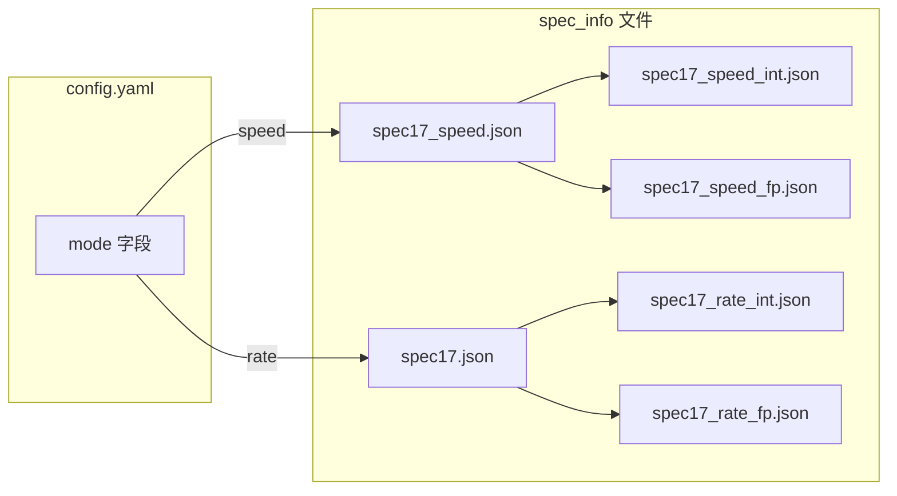

# Speed/Rate 模式说明

## 概述

SPEC CPU2017 有两种测试模式：

- **Speed 模式**：单份 workload 执行，测量单任务完成时间
- **Rate 模式**：多份 workload 并行执行，测量系统吞吐量

两种模式的 benchmark 子集和输入参数不同，本工具通过 config.yaml 中的 `mode` 字段切换。

## Benchmark 对比

### Integer 套件

| Speed 模式 | Rate 模式 | 差异 |
|-----------|----------|------|
| deepsjeng | deepsjeng | - |
| exchange2 | exchange2 | - |
| gcc_pp_opts_O5_fipa-pta | gcc_pp_O2 | speed 用新命名，参数不同 |
| gcc_pp_opts_O5_finline-limit_1000 | gcc_pp_O3 | speed 用新命名，参数不同 |
| gcc_pp_opts_O5_finline-limit_24000 | gcc_ref32_O3 | speed 用新命名，参数不同 |
| - | gcc_ref32_O5 | 仅 rate |
| - | gcc_small_O3 | 仅 rate |
| leela | leela | - |
| mcf | mcf | - |
| omnetpp | omnetpp | - |
| perlbench_diff | perlbench_diff | - |
| perlbench_spam | perlbench_spam | - |
| perlbench_split | perlbench_split | - |
| x264_pass1 | x264_pass1 | - |
| x264_pass2 | x264_pass2 | - |
| x264_seek | x264_seek | - |
| xalancbmk | xalancbmk | 参数格式略有不同 |
| xz_cld | xz_cld | 输入参数不同 |
| - | xz_combined | 仅 rate |
| xz_cpu2006 | xz_cpu2006 | 输入参数不同 |

### Floating Point 套件

| Speed 模式 | Rate 模式 | 差异 |
|-----------|----------|------|
| - | blender | 仅 rate |
| bwaves_1 | bwaves_1 | rate 包含更多输入文件 |
| bwaves_2 | bwaves_2 | rate 包含更多输入文件 |
| - | bwaves_3 | 仅 rate |
| - | bwaves_4 | 仅 rate |
| cactuBSSN | cactuBSSN | - |
| cam4 | cam4 | speed 包含更多输入文件 |
| fotonik3d | fotonik3d | 输入文件不同（25nm 变体） |
| imagick | imagick | 完全不同的输入和处理管线 |
| lbm | lbm | 迭代次数和网格大小不同 |
| nab | nab | 不同的分子结构输入 |
| - | namd | 仅 rate |
| pop2 | - | 仅 speed |
| - | parest | 仅 rate |
| - | povray | 仅 rate |
| roms | roms | 不同的 ocean benchmark 输入 |
| wrf | wrf | speed 包含更多输入文件 |

## 使用方法

### 1. 修改 config.yaml

```yaml
base_config:
  mode: "speed"    # 生成 speed 模式 checkpoint
  # mode: "rate"   # 生成 rate 模式 checkpoint
  CPU2017: true
  ...
```

### 2. 生成 checkpoint

```bash
# Speed 模式
python3 generate_checkpoint.py --config config.yaml

# Rate 模式（修改 config.yaml 中 mode 为 rate 后）
python3 generate_checkpoint.py --config config.yaml
```

### 3. 导出结果

```bash
# Speed 模式，int 套件
python3 dump_result.py --base-path /path/to/archive --mode speed --suite int

# Rate 模式，fp 套件
python3 dump_result.py --base-path /path/to/archive --mode rate --suite fp

# Rate 模式，全部
python3 dump_result.py --base-path /path/to/archive --mode rate --suite all
```

## spec_info 文件映射



| 文件 | 内容 | 用途 |
|------|------|------|
| `spec17_speed.json` | 28 个 speed 模式 benchmark | `mode=speed` 时加载 |
| `spec17.json` | 36 个 rate 模式 benchmark | `mode=rate` 时加载 |
| `spec17_speed_int.json` | 17 个 speed int 子集 | 辅助参考 |
| `spec17_speed_fp.json` | 11 个 speed fp 子集 | 辅助参考 |
| `spec17_rate_int.json` | 20 个 rate int 子集 | dump_result.py 使用 |
| `spec17_rate_fp.json` | 16 个 rate fp 子集 | dump_result.py 使用 |

## archive_id 命名

`mode` 值会体现在 archive 目录名中，避免 speed/rate 结果混淆：

```
archive/
├── spec17_speed_xscc_rv64gcb_base_..._2026-05-29-10-00/
└── spec17_rate_xscc_rv64gcb_base_..._2026-05-29-10-30/
```
